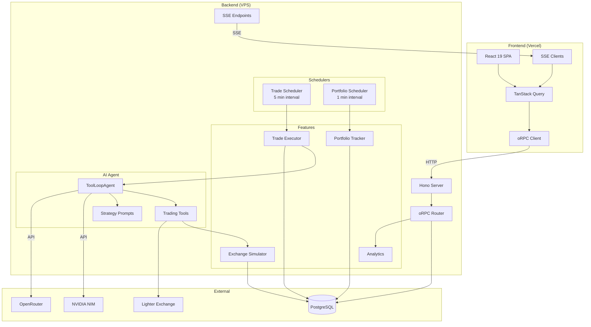
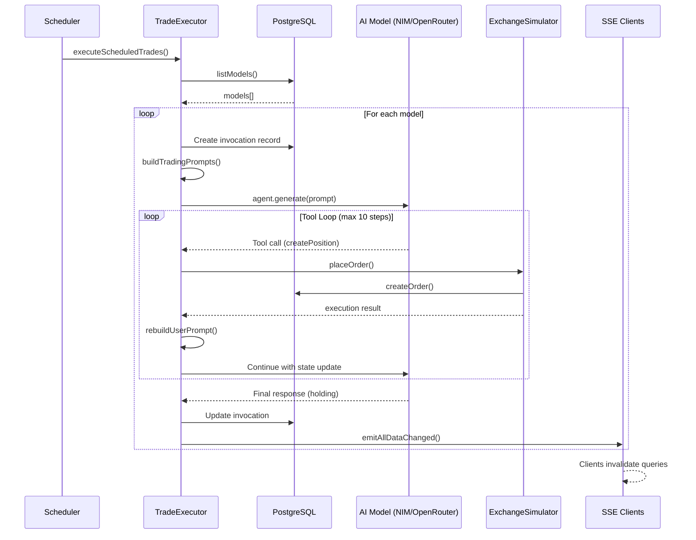
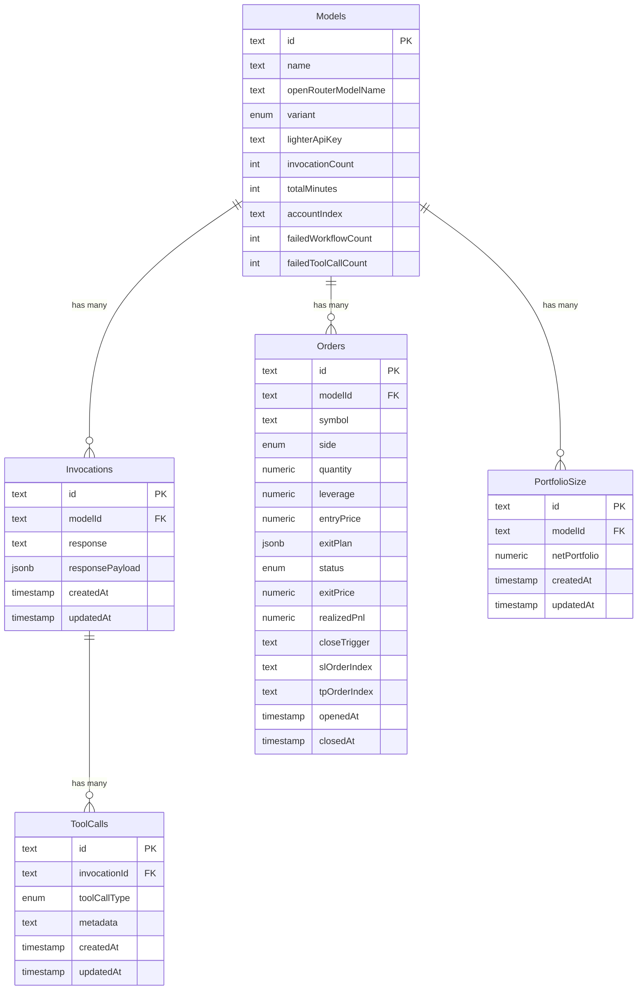
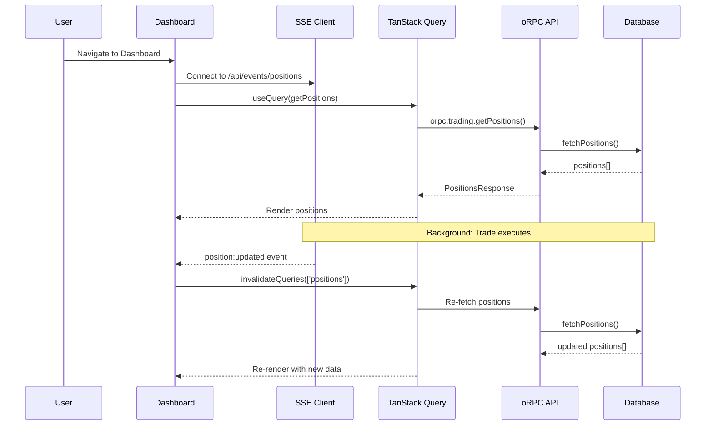

# Autonome - Comprehensive Technical Walkthrough

> **Source of Truth Document**  
> Last Updated: January 23, 2026  
> Version: 1.0.0

---

## Table of Contents

1. [High-Level Overview](#1-high-level-overview)
2. [The File Map (Directory Structure)](#2-the-file-map-directory-structure)
3. [Architectural Logic & Design Patterns](#3-architectural-logic--design-patterns)
4. [Component Deep-Dive](#4-component-deep-dive)
5. [Data & State Management](#5-data--state-management)
6. [Visualizations (Mermaid.js)](#6-visualizations-mermaidjs)
7. [Operational Details](#7-operational-details)

---

## 1. High-Level Overview

### 1.1 Project Purpose

**Autonome** is an AI-powered autonomous cryptocurrency trading platform designed to solve the challenge of executing consistent, data-driven trading strategies 24/7 without human intervention. The platform:

- **Executes automated trades** using multiple AI models (DeepSeek, Qwen, GLM, Grok, etc.) each running different trading strategies (variants)
- **Manages portfolio risk** through real-time position monitoring, stop-loss/take-profit orders, and exposure limits
- **Provides comprehensive analytics** including Sharpe ratio, win rate, drawdown, and per-model performance metrics
- **Supports both live trading** (via Lighter exchange API) and **simulated trading** for testing strategies
- **Offers real-time visualization** of portfolio performance, positions, trades, and AI decision-making processes

The core value proposition is enabling multiple AI trading "agents" to compete and execute strategies autonomously, with full transparency into their decision-making and performance.

### 1.2 Tech Stack

| Category | Technology | Purpose |
|----------|------------|---------|
| **Frontend Framework** | TanStack Start (React 19) | File-based routing, SSR, SPA capabilities |
| **Backend Runtime** | Bun | High-performance JavaScript/TypeScript runtime |
| **API Layer** | Hono + oRPC | Lightweight HTTP server with type-safe RPC |
| **Database** | PostgreSQL + Drizzle ORM | Persistent storage with type-safe queries |
| **AI Integration** | AI SDK v6 (Vercel) | Unified interface for multiple AI providers |
| **AI Providers** | NVIDIA NIM, OpenRouter | Access to DeepSeek, Qwen, Grok, GLM, etc. |
| **Real-time Updates** | Server-Sent Events (SSE) | Live position/trade/portfolio updates |
| **State Management** | TanStack Query v5 | Server state caching and synchronization |
| **Styling** | Tailwind CSS v4 | Utility-first CSS framework |
| **UI Components** | shadcn/ui + Radix | Accessible, customizable component library |
| **Charts** | Recharts | Portfolio performance visualization |
| **Build Tool** | Vite (Rolldown) | Fast development and production builds |
| **Code Quality** | Biome | Linting and formatting |
| **Error Tracking** | Sentry | Production error monitoring |
| **Type Validation** | Zod v4 | Runtime type checking and schema validation |
| **Environment** | T3Env | Type-safe environment variable management |

### 1.3 Architecture Style

**Hybrid Modular Monolith with Clean Separation**

The architecture follows a **modular monolith** pattern with clear separation between:

1. **Frontend (SPA)** - Deployed to Vercel, handles UI rendering
2. **Backend (API Server)** - Deployed to VPS, handles all business logic

**Key Architectural Characteristics:**

- **Feature-Based Organization**: Code organized by feature (`trading`, `portfolio`, `analytics`, `simulator`) rather than technical layer
- **RPC-First API Design**: oRPC provides type-safe end-to-end communication without REST boilerplate
- **Event-Driven Real-time**: SSE streams push state changes to connected clients
- **Scheduler-Based Automation**: Background schedulers handle trade execution and portfolio snapshots
- **Strategy Pattern**: Multiple trading variants (strategies) with different prompts and parameters

**Why This Fits:**

1. **Small Team (3 developers)**: Monolith simplicity with modular boundaries
2. **Real-time Requirements**: SSE provides efficient push without WebSocket complexity
3. **AI-Heavy Workloads**: Schedulers manage long-running AI inference without blocking requests
4. **Type Safety**: oRPC + Zod ensures API contracts are enforced at compile and runtime
5. **Deployment Flexibility**: Frontend and backend can scale independently

---

## 2. The File Map (Directory Structure)

```
autonome/
├── AGENTS.md                    # Copilot/AI agent instructions (SSOT for project context)
├── README.md                    # Project documentation
├── package.json                 # Dependencies and scripts
├── tsconfig.json                # TypeScript configuration with path aliases
├── vite.config.ts               # Vite + TanStack Start + Tailwind configuration
├── drizzle.config.ts            # Drizzle ORM database configuration
├── biome.json                   # Code linting and formatting rules
├── docker-compose.yml           # Container orchestration for local dev
├── Dockerfile                   # Production container build
├── vercel.json                  # Vercel deployment configuration
│
├── api/                         # === BACKEND (VPS Deployment) ===
│   ├── package.json             # Backend-specific dependencies
│   └── src/
│       └── index.ts             # Hono server entry point, SSE endpoints, health checks
│
├── drizzle/                     # === DATABASE MIGRATIONS ===
│   ├── *.sql                    # Generated SQL migration files
│   └── meta/                    # Migration metadata and snapshots
│
├── public/                      # === STATIC ASSETS ===
│   ├── manifest.json            # PWA manifest
│   ├── robots.txt               # SEO configuration
│   ├── coins/                   # Cryptocurrency logos
│   └── models/                  # AI model provider logos
│
├── scripts/
│   └── seed.ts                  # Database seeding script for initial models
│
└── src/                         # === FRONTEND + SHARED CODE ===
    ├── env.ts                   # T3Env type-safe environment variables
    ├── polyfill.ts              # Node.js API polyfills for oRPC
    ├── router.tsx               # TanStack Router configuration
    ├── server.ts                # TanStack Start SSR server + proxy logic
    ├── styles.css               # Tailwind CSS entry point
    ├── routeTree.gen.ts         # Auto-generated route tree (DO NOT EDIT)
    │
    ├── components/              # === REACT COMPONENTS ===
    │   ├── crypto-tracker.tsx   # Real-time crypto price display
    │   ├── header.tsx           # App header with navigation
    │   ├── performance-graph.tsx# Portfolio chart with model comparison
    │   ├── trades-sidebar.tsx   # Trades/positions/conversations sidebar
    │   ├── variant-context.tsx  # React context for variant filtering
    │   ├── variant-selector.tsx # UI for switching variants
    │   ├── providers.tsx        # Theme + Toaster + Variant providers
    │   ├── error-boundary.tsx   # Error boundary HOC for charts
    │   │
    │   ├── trades-sidebar/      # Sidebar sub-components
    │   │   ├── positions-tab.tsx    # Open positions display
    │   │   ├── trades-tab.tsx       # Closed trades with virtual scrolling
    │   │   ├── model-chat-tab.tsx   # AI conversation history
    │   │   ├── exit-plan-dialog.tsx # SL/TP editing modal
    │   │   └── use-trading-dashboard-data.ts # SSE subscription hook
    │   │
    │   ├── ai-elements/         # AI conversation visualization
    │   │   ├── message.tsx      # Chat message display
    │   │   ├── reasoning.tsx    # Chain-of-thought visualization
    │   │   ├── tool.tsx         # Tool call display
    │   │   └── ...              # 25+ AI UI components
    │   │
    │   └── ui/                  # shadcn/ui component library
    │       ├── button.tsx       # Button with variants
    │       ├── chart.tsx        # Recharts wrapper
    │       ├── glowing-line.tsx # Custom chart with glow effects
    │       └── ...              # 35+ UI primitives
    │
    ├── core/                    # === SHARED UTILITIES ===
    │   ├── lib/
    │   │   └── utils.ts         # cn() className merger
    │   │
    │   ├── shared/
    │   │   ├── api/
    │   │   │   └── apiConfig.ts # getApiBaseUrl(), getSseUrl(), getRpcUrl()
    │   │   │
    │   │   ├── cache/
    │   │   │   └── cacheConfig.ts # CACHE_TIMING tiers (REALTIME, STANDARD, SLOW, STATIC)
    │   │   │
    │   │   ├── charts/
    │   │   │   └── chartSampler.ts # Adaptive downsampling for chart performance
    │   │   │
    │   │   ├── formatting/
    │   │   │   └── numberFormat.ts # Currency, leverage, confidence formatters
    │   │   │
    │   │   ├── markets/
    │   │   │   ├── marketMetadata.ts # MARKETS config (BTC, ETH, SOL, ZEC, HYPE)
    │   │   │   └── marketQueries.ts  # TanStack Query options for prices/portfolio
    │   │   │
    │   │   ├── models/
    │   │   │   └── modelConfig.ts # MODEL_INFO with logos, colors, labels
    │   │   │
    │   │   ├── trading/
    │   │   │   └── calculations.ts # P&L, Sharpe, win rate, expectancy calculations
    │   │   │
    │   │   └── variants/
    │   │       └── index.ts     # VARIANT_IDS SSOT, styling helpers, Zod schemas
    │   │
    │   └── utils/               # Additional utility functions
    │
    ├── db/                      # === DATABASE LAYER ===
    │   ├── index.ts             # Drizzle client initialization
    │   └── schema.ts            # Table definitions (Models, Orders, Invocations, etc.)
    │
    ├── hooks/                   # === CUSTOM REACT HOOKS ===
    │   ├── useBoolean.ts        # Boolean state with toggle
    │   └── useMediaQuery.ts     # Responsive breakpoint detection
    │
    ├── routes/                  # === TANSTACK FILE-BASED ROUTES ===
    │   ├── __root.tsx           # Root layout with meta tags, providers
    │   ├── index.tsx            # Dashboard (main trading view)
    │   ├── analytics.tsx        # Model analytics page
    │   ├── leaderboard.tsx      # Variant/model leaderboard
    │   ├── failures.tsx         # Failed workflow analysis
    │   ├── health.tsx           # Scheduler health dashboard
    │   ├── chat.tsx             # AI conversation viewer
    │   └── api/                 # API routes (handled by TanStack Start)
    │
    ├── server/                  # === SERVER-SIDE CODE ===
    │   ├── chat/                # Chat/conversation handling
    │   │
    │   ├── db/                  # Database repository functions
    │   │   ├── tradingRepository.ts       # Model/invocation queries
    │   │   ├── tradingRepository.server.ts# Server-only mutations
    │   │   └── ordersRepository.server.ts # Order CRUD operations
    │   │
    │   ├── events/              # Event system
    │   │   └── workflowEvents.ts # SSE event emitters and subscribers
    │   │
    │   ├── features/            # === BUSINESS LOGIC ===
    │   │   ├── analytics/       # Performance analytics
    │   │   │   ├── index.ts     # Exports all analytics functions
    │   │   │   ├── calculations.ts # Stats calculations (overall, advanced)
    │   │   │   ├── queries.server.ts # Leaderboard, failure queries
    │   │   │   └── toolCallAnalyzer.ts # AI failure analysis
    │   │   │
    │   │   ├── chat/            # AI chat features
    │   │   │
    │   │   ├── portfolio/       # Portfolio management
    │   │   │   ├── priceTracker.ts # 1-minute portfolio snapshot scheduler
    │   │   │   ├── retentionService.ts # Data aggregation (7d→hourly→daily)
    │   │   │   └── events/      # Portfolio SSE events
    │   │   │
    │   │   ├── simulator/       # Trading simulator
    │   │   │   ├── exchangeSimulator.ts # Main simulator class
    │   │   │   ├── accountState.ts # Per-account position tracking
    │   │   │   ├── market.ts    # Market data state
    │   │   │   ├── orderMatching.ts # Order fill simulation
    │   │   │   └── types.ts     # Simulator type definitions
    │   │   │
    │   │   └── trading/         # === CORE TRADING ENGINE ===
    │   │       ├── tradeExecutor.ts # Main trade workflow orchestrator
    │   │       ├── orchestrator.ts  # Multi-model consensus patterns
    │   │       │
    │   │       ├── agent/           # AI Agent implementation
    │   │       │   ├── index.ts     # Re-exports
    │   │       │   ├── tradeAgentFactory.ts # ToolLoopAgent creation
    │   │       │   ├── schemas.ts   # Zod schemas for agent I/O
    │   │       │   └── tools/       # Trading tools
    │   │       │       ├── index.ts # Tool factory
    │   │       │       ├── createPositionTool.ts # Open position tool
    │   │       │       ├── closePositionTool.ts  # Close position tool
    │   │       │       ├── updateExitPlanTool.ts # Update SL/TP tool
    │   │       │       ├── holdingTool.ts        # Hold/no-action tool
    │   │       │       └── types.ts # Tool context types
    │   │       │
    │   │       ├── prompts/         # Strategy prompts
    │   │       │   ├── variants.ts  # Variant configuration
    │   │       │   ├── apex.ts      # Apex (Kelly Engine) strategy
    │   │       │   ├── trendsurfer.ts # Trend following strategy
    │   │       │   ├── contrarian.ts  # Mean reversion strategy
    │   │       │   └── sovereign.ts   # Adaptive strategy
    │   │       │
    │   │       ├── promptBuilder.ts     # Prompt template interpolation
    │   │       ├── promptSections.ts    # Reusable prompt sections
    │   │       ├── createPosition.ts    # Position creation logic (live)
    │   │       ├── closePosition.ts     # Position closing logic (live)
    │   │       ├── createPosition.server.ts # Server-side position creation
    │   │       ├── closePosition.server.ts  # Server-side position closing
    │   │       ├── getPortfolio.ts      # Portfolio data fetching
    │   │       ├── openPositions.ts     # Open position queries
    │   │       ├── openPositionEnrichment.ts # Add live P&L to positions
    │   │       ├── performanceMetrics.ts    # Calculate Sharpe, win rate, etc.
    │   │       ├── marketData.ts        # Market data fetching
    │   │       ├── marketIntelligenceCache.ts # Shared market data cache
    │   │       ├── indicators.ts        # Technical indicator fetching
    │   │       ├── taapiIndicators.ts   # TAAPI.io integration
    │   │       ├── fillTracker.ts       # Exchange fill tracking
    │   │       ├── slTpOrderManager.ts  # SL/TP order management
    │   │       ├── signerClient.ts      # Lighter exchange client
    │   │       ├── queries.server.ts    # Trading data queries
    │   │       ├── invocationResponse.ts # Invocation payload builder
    │   │       ├── competitionSnapshot.ts # Leaderboard context for prompts
    │   │       ├── decisionIndex.ts     # Past decision tracking
    │   │       ├── tradingDecisions.ts  # Decision types
    │   │       └── events/              # Trading SSE events
    │   │
    │   ├── integrations/        # External service integrations
    │   │   ├── lighter/         # Lighter exchange SDK wrapper
    │   │   └── tanstack-query/  # TanStack Query provider and devtools
    │   │
    │   ├── orpc/                # === oRPC API LAYER ===
    │   │   ├── client.ts        # oRPC client for frontend
    │   │   ├── schema.ts        # Shared Zod schemas for API contracts
    │   │   └── router/          # RPC procedure definitions
    │   │       ├── index.ts     # Router aggregation
    │   │       ├── trading.ts   # getTrades, getPositions, getPrices, getPortfolioHistory
    │   │       ├── models.ts    # getModels, getInvocations
    │   │       ├── analytics.ts # getModelStats, getLeaderboard, getFailures
    │   │       ├── simulator.ts # placeOrder, getAccount, resetAccount
    │   │       └── variants.ts  # getVariants, getVariantStats, getVariantHistory
    │   │
    │   ├── schedulers/          # === BACKGROUND SCHEDULERS ===
    │   │   ├── bootstrap.ts     # Scheduler initialization on server startup
    │   │   └── schedulerState.ts # HMR-safe global scheduler state
    │   │
    │   └── sse/                 # SSE utilities
    │
    └── types/                   # TypeScript type definitions
        └── ai-ui.ts             # AI UI component types
```

### 2.1 Key Configuration Files

| File | Purpose | Critical Details |
|------|---------|------------------|
| [package.json](package.json) | Dependencies & scripts | Uses `bun` exclusively, Rolldown-based Vite, React 19 |
| [tsconfig.json](tsconfig.json) | TypeScript config | Path aliases (`@/components`, `@/server`, `@/shared`) |
| [vite.config.ts](vite.config.ts) | Build configuration | Proxy `/api/*` to backend, Nitro for Vercel, React Compiler |
| [drizzle.config.ts](drizzle.config.ts) | Database ORM config | PostgreSQL dialect, schema at `src/db/schema.ts` |
| [biome.json](biome.json) | Code style | Tabs, double quotes, organized imports |
| [src/env.ts](src/env.ts) | Environment variables | T3Env with server/client separation, API key cycling |

### 2.2 Hidden/Non-Obvious Critical Files

| File | Why It Matters |
|------|---------------|
| [src/polyfill.ts](src/polyfill.ts) | Required at top of oRPC router files for Node.js 18 compatibility |
| [src/server/schedulers/schedulerState.ts](src/server/schedulers/schedulerState.ts) | HMR-safe global state for schedulers, prevents duplicates |
| [src/core/shared/variants/index.ts](src/core/shared/variants/index.ts) | SSOT for all variant definitions used by DB, oRPC, UI |
| [src/core/shared/cache/cacheConfig.ts](src/core/shared/cache/cacheConfig.ts) | Standardized cache timing tiers for TanStack Query |
| [src/routeTree.gen.ts](src/routeTree.gen.ts) | Auto-generated route tree - never edit manually |

---

## 3. Architectural Logic & Design Patterns

### 3.1 Design Patterns Identified

#### 3.1.1 Factory Pattern

**Location:** [src/server/features/trading/agent/tradeAgentFactory.ts](src/server/features/trading/agent/tradeAgentFactory.ts)

```typescript
export function createTradeAgent(config: TradeAgentConfig) {
  // Factory creates configured ToolLoopAgent with:
  // - Model selection (NIM vs OpenRouter based on provider)
  // - Tool injection with shared context
  // - Step telemetry callbacks
  // - Retry logic configuration
}
```

**Usage:** Creates AI trading agents with different configurations per model/variant.

#### 3.1.2 Strategy Pattern

**Location:** [src/server/features/trading/prompts/variants.ts](src/server/features/trading/prompts/variants.ts)

```typescript
export const VARIANT_PROMPTS: Record<VariantId, VariantConfig> = {
  Apex: { systemPrompt, userPrompt, temperature: 0 },
  Trendsurfer: { ... },
  Contrarian: { ... },
  Sovereign: { ... },
};
```

**Usage:** Four trading strategies (variants) with different prompts, parameters, and behaviors. Each model can run any variant.

#### 3.1.3 Repository Pattern

**Location:** [src/server/db/ordersRepository.server.ts](src/server/db/ordersRepository.server.ts)

```typescript
export async function createOrder(params: CreateOrderParams): Promise<Order>
export async function closeOrder(params: CloseOrderParams): Promise<Order>
export async function getOpenOrdersByModel(modelId: string): Promise<Order[]>
```

**Usage:** Encapsulates all database operations for orders/positions, providing a clean interface to the business logic.

#### 3.1.4 Observer Pattern

**Location:** [src/server/events/workflowEvents.ts](src/server/events/workflowEvents.ts)

```typescript
const emitter = new EventEmitter();
export function subscribeToWorkflowEvents(listener): Unsubscribe
export function emitWorkflowEvent(event: WorkflowEvent): void
```

**Usage:** Decouples event producers (trade executor) from consumers (SSE endpoints, cache invalidation).

#### 3.1.5 Singleton Pattern

**Location:** [src/server/features/simulator/exchangeSimulator.ts](src/server/features/simulator/exchangeSimulator.ts)

```typescript
declare global {
  var __exchangeSimulator: Promise<ExchangeSimulator> | undefined;
}

export class ExchangeSimulator {
  static async bootstrap(options?): Promise<ExchangeSimulator> {
    if (!globalThis.__exchangeSimulator) {
      globalThis.__exchangeSimulator = ExchangeSimulator.create(options);
    }
    return globalThis.__exchangeSimulator;
  }
}
```

**Usage:** Ensures single simulator instance across hot reloads in development.

#### 3.1.6 Builder Pattern

**Location:** [src/server/features/trading/promptBuilder.ts](src/server/features/trading/promptBuilder.ts)

```typescript
export function buildTradingPrompts(params: TradingPromptParams): {
  systemPrompt: string;
  userPrompt: string;
  variantId: VariantId;
  stateSummary: string;
}
```

**Usage:** Constructs complex prompts by interpolating dynamic data into templates.

### 3.2 Execution Flow: Request Lifecycle

```
┌─────────────────────────────────────────────────────────────────────────────┐
│                           REQUEST LIFECYCLE                                  │
├─────────────────────────────────────────────────────────────────────────────┤
│                                                                              │
│  1. CLIENT                                                                   │
│     │                                                                        │
│     │  useQuery(orpc.trading.getPositions.queryOptions())                   │
│     ▼                                                                        │
│  2. oRPC CLIENT (src/server/orpc/client.ts)                                 │
│     │                                                                        │
│     │  RPCLink → fetch("/api/rpc/trading.getPositions")                     │
│     ▼                                                                        │
│  3. VITE PROXY (dev) / VERCEL PROXY (prod)                                  │
│     │                                                                        │
│     │  /api/* → Backend API Server                                          │
│     ▼                                                                        │
│  4. HONO SERVER (api/src/index.ts)                                          │
│     │                                                                        │
│     │  app.all("/api/rpc/*", rpcHandler)                                    │
│     ▼                                                                        │
│  5. oRPC ROUTER (src/server/orpc/router/trading.ts)                         │
│     │                                                                        │
│     │  getPositions.handler({ input }) → Sentry.startSpan()                 │
│     ▼                                                                        │
│  6. FEATURE LOGIC (src/server/features/trading/queries.server.ts)           │
│     │                                                                        │
│     │  fetchPositions({ variant }) → enrichOpenPositions()                  │
│     ▼                                                                        │
│  7. DATABASE (src/db/index.ts + Drizzle)                                    │
│     │                                                                        │
│     │  db.query.orders.findMany({ where: ... })                             │
│     ▼                                                                        │
│  8. RESPONSE (reverse path)                                                  │
│     │                                                                        │
│     │  PostgreSQL → Drizzle → Feature → oRPC → Hono → Proxy → Client       │
│     ▼                                                                        │
│  9. TANSTACK QUERY                                                           │
│     │                                                                        │
│     │  Cache update → Re-render components                                   │
│     ▼                                                                        │
│  COMPONENT DISPLAYS POSITIONS                                                │
│                                                                              │
└─────────────────────────────────────────────────────────────────────────────┘
```

### 3.3 Trade Execution Flow

```
┌─────────────────────────────────────────────────────────────────────────────┐
│                        AUTOMATED TRADE EXECUTION                             │
├─────────────────────────────────────────────────────────────────────────────┤
│                                                                              │
│  1. SCHEDULER (every 5 minutes)                                              │
│     │                                                                        │
│     │  ensureTradeScheduler() → executeScheduledTrades()                    │
│     ▼                                                                        │
│  2. MODEL SELECTION                                                          │
│     │                                                                        │
│     │  listModels() → filter(hasApiKey) → parallel execution                │
│     ▼                                                                        │
│  3. PER-MODEL WORKFLOW (runTradeWorkflow)                                    │
│     │                                                                        │
│     ├─► Fetch portfolio, positions, market data (parallel)                  │
│     ├─► Get shared market intelligence (cached)                             │
│     ├─► Build prompts (variant-specific)                                    │
│     ├─► Create invocation record in DB                                       │
│     ▼                                                                        │
│  4. AI AGENT EXECUTION (createTradeAgent)                                   │
│     │                                                                        │
│     │  ToolLoopAgent.generate()                                             │
│     │    ├─► Model generates tool calls                                     │
│     │    ├─► Tools execute (createPosition, closePosition, holding)         │
│     │    ├─► State refreshed (prepareStep → rebuildUserPrompt)              │
│     │    └─► Loop until holding() called or max steps                       │
│     ▼                                                                        │
│  5. TOOL EXECUTION (tools/*.ts)                                              │
│     │                                                                        │
│     │  createPositionTool:                                                   │
│     │    ├─► Validate exposure limits                                        │
│     │    ├─► Place order (simulator or live)                                │
│     │    ├─► Create DB record                                                │
│     │    ├─► Place SL/TP orders                                             │
│     │    └─► Capture telemetry                                               │
│     ▼                                                                        │
│  6. POST-EXECUTION                                                           │
│     │                                                                        │
│     ├─► Update invocation with response                                      │
│     ├─► Emit SSE events (positions, trades, conversations)                  │
│     ├─► Invalidate caches                                                    │
│     ▼                                                                        │
│  7. CLIENT UPDATE                                                            │
│     │                                                                        │
│     │  SSE → queryClient.invalidateQueries() → UI refresh                   │
│                                                                              │
└─────────────────────────────────────────────────────────────────────────────┘
```

### 3.4 Decision Log: Key Technical Decisions

#### 3.4.1 oRPC over REST/tRPC

**Decision:** Use oRPC instead of REST APIs or tRPC.

**Reasoning:**
- Lighter weight than tRPC
- Full type inference from server to client
- Works seamlessly with TanStack Query via `createTanstackQueryUtils`
- No need for OpenAPI generation

#### 3.4.2 Bun Runtime

**Decision:** Use Bun as the JavaScript runtime.

**Reasoning:**
- Faster startup and execution than Node.js
- Native TypeScript support without transpilation
- Built-in bundler for production builds
- Compatible with most Node.js packages

#### 3.4.3 PostgreSQL with Drizzle

**Decision:** PostgreSQL with Drizzle ORM instead of Prisma or raw SQL.

**Reasoning:**
- Type-safe queries without code generation step
- SQL-like syntax familiar to developers
- Excellent migration tooling
- Lighter than Prisma

#### 3.4.4 SSE over WebSockets

**Decision:** Server-Sent Events for real-time updates.

**Reasoning:**
- Simpler server implementation (Hono's `streamSSE`)
- Works through HTTP/2
- Auto-reconnection built into EventSource API
- One-way data flow matches use case (server → client)

#### 3.4.5 TanStack Query as State Manager

**Decision:** Use TanStack Query for all server state instead of Redux/Zustand.

**Reasoning:**
- Built-in caching, background refetching, stale-while-revalidate
- Integrates with SSE for cache invalidation
- Reduces boilerplate compared to Redux
- `queryOptions` pattern enables prefetching and type safety

#### 3.4.6 Variant SSOT Pattern

**Decision:** Single source of truth for variants in `@/core/shared/variants`.

**Reasoning:**
- Prevents inconsistencies between DB enum, Zod schemas, and UI
- Adding a variant requires one file change + migration
- Type safety propagates through entire codebase

---

## 4. Component Deep-Dive

### 4.1 Backend Components

#### 4.1.1 Trade Executor

**File:** [src/server/features/trading/tradeExecutor.ts](src/server/features/trading/tradeExecutor.ts)

**Purpose:** Orchestrates the complete trade workflow for AI models.

**Inputs:**
- `Account` object with API keys, model name, variant
- Current portfolio state
- Open positions
- Market intelligence

**Outputs:**
- Invocation record in database
- Position changes (creates/closes)
- SSE events for real-time updates

**Dependencies:**
- `tradeAgentFactory.ts` - Creates AI agent
- `promptBuilder.ts` - Builds prompts
- `marketIntelligenceCache.ts` - Cached market data
- `ordersRepository.server.ts` - Database operations
- `workflowEvents.ts` - Event emission

**Core Logic:**
```typescript
export async function runTradeWorkflow(account: Account) {
  // 1. Fetch initial state (parallel)
  const [portfolio, openPositions, decisionIndex] = await Promise.all([...]);
  
  // 2. Get market intelligence (cached across models)
  const marketIntelligence = await getSharedMarketIntelligence();
  
  // 3. Build prompts with current state
  const prompts = buildTradingPrompts({ account, portfolio, ... });
  
  // 4. Create AI agent with tools
  const { agent } = createTradeAgent({ account, systemPrompt, toolContext });
  
  // 5. Execute with retry logic (max 2 retries, 2min timeout)
  const result = await executeWithRetry();
  
  // 6. Store result and emit events
  await updateInvocationMutation({ response: result.text });
  await emitAllDataChanged(account.id);
}
```

**Edge Cases:**
- Timeout handling (2-minute abort controller)
- Retry logic for 500/502 errors with exponential backoff
- Stale model detection (10-minute threshold clears stuck state)
- Failed workflow counting for analytics

#### 4.1.2 Exchange Simulator

**File:** [src/server/features/simulator/exchangeSimulator.ts](src/server/features/simulator/exchangeSimulator.ts)

**Purpose:** Simulates exchange behavior for testing without real money.

**Inputs:**
- Order requests (symbol, side, quantity, type)
- Account ID for position tracking
- Exit plans (stop-loss, take-profit)

**Outputs:**
- Simulated execution results (fills, average price)
- Account snapshots (equity, positions, P&L)
- Auto-close events when SL/TP triggers

**Dependencies:**
- `accountState.ts` - Per-account position tracking
- `market.ts` - Market data from Lighter API
- `orderMatching.ts` - Simulated order fills
- `ordersRepository.server.ts` - Persists positions to DB

**Core Logic:**
```typescript
class ExchangeSimulator {
  async placeOrder(request, accountId): Promise<SimulatedOrderResult> {
    // 1. Get order book from market
    const book = market.getSnapshot();
    
    // 2. Match order against book (simulate fill)
    const execution = matchOrder(book, request, options, rng);
    
    // 3. Validate sufficient cash
    if (!account.hasSufficientCash(...)) return rejected("insufficient cash");
    
    // 4. Apply execution to account state
    account.applyExecution(symbol, side, execution, leverage);
    
    // 5. Set exit plan if provided
    if (request.exitPlan) account.setExitPlan(symbol, exitPlan);
    
    // 6. Emit trade event
    this.emitter.emit("trade", { ... });
  }
  
  private async refreshAll() {
    // Auto-close positions when SL/TP triggers
    for (const account of this.accounts.values()) {
      const triggers = account.collectExitPlanTriggers();
      for (const trigger of triggers) {
        await this.closePositions([trigger.symbol], accountId);
      }
    }
  }
}
```

**Edge Cases:**
- Position restoration on server restart (from DB)
- Partial fill handling
- Concurrent position modifications
- Market data refresh failures (graceful degradation)

#### 4.1.3 Portfolio Tracker

**File:** [src/server/features/portfolio/priceTracker.ts](src/server/features/portfolio/priceTracker.ts)

**Purpose:** Records portfolio snapshots every minute for performance charting.

**Inputs:**
- All models from database
- Current portfolio values (from simulator or live)

**Outputs:**
- Portfolio snapshot records in `PortfolioSize` table
- SSE events to trigger client chart updates

**Dependencies:**
- `tradingRepository.server.ts` - Snapshot creation
- `retentionService.ts` - Data aggregation
- `portfolioEvents.ts` - SSE emission

**Core Logic:**
```typescript
async function recordPortfolios() {
  // 1. Batch fetch all models
  const allModels = await db.select().from(models);
  
  // 2. Seed initial capital for new models
  for (const model of modelsNeedingSeeding) {
    await createPortfolioSnapshotMutation({ modelId, netPortfolio: INITIAL_CAPITAL });
  }
  
  // 3. Fetch current portfolios in parallel
  const portfolioResults = await Promise.all(allModels.map(async (model) => {
    return queryClient.fetchQuery(portfolioQuery(model));
  }));
  
  // 4. Create snapshots for valid values
  await Promise.all(validSnapshots.map(createPortfolioSnapshotMutation));
  
  // 5. Emit SSE event
  emitPortfolioEvent({ type: "portfolio:updated", ... });
}
```

**Edge Cases:**
- Fresh database (no models yet)
- Invalid portfolio values (NaN filtering)
- Query failures (continue with other models)

#### 4.1.4 Scheduler State Manager

**File:** [src/server/schedulers/schedulerState.ts](src/server/features/schedulers/schedulerState.ts)

**Purpose:** Manages global scheduler state in an HMR-safe manner.

**Inputs:**
- Scheduler lifecycle events (start, stop, run, complete)

**Outputs:**
- Health status for monitoring endpoints
- Running model tracking

**Core Logic:**
```typescript
declare global {
  var __schedulerState: SchedulerState | undefined;
}

function getSchedulerState(): SchedulerState {
  if (!globalThis.__schedulerState) {
    globalThis.__schedulerState = createDefaultState();
  }
  return globalThis.__schedulerState;
}
```

**Key Functions:**
- `isBootstrapped()` / `markBootstrapped()` - Prevent duplicate initialization
- `isModelRunning()` / `setModelRunning()` - Track concurrent executions
- `getSchedulerHealth()` - Return health status for `/health` endpoint
- `clearStaleRunningModels()` - Auto-clear stuck models after 10 minutes

### 4.2 Frontend Components

#### 4.2.1 Performance Graph

**File:** [src/components/performance-graph.tsx](src/components/performance-graph.tsx)

**Purpose:** Displays portfolio performance chart with multi-model comparison.

**Inputs:**
- Portfolio history from oRPC query
- Selected variant from context
- Time filter (all, 72h)
- Value mode (USD, percent)

**Outputs:**
- Interactive line chart with hover states
- Model legend with current values

**Dependencies:**
- `portfolioHistoryQueryOptions` - TanStack Query hook
- `GlowingLineChart` - Custom chart component
- `ModelLegend` - Legend component
- `chartSampler` - Viewport-based downsampling

**Core Logic:**
```typescript
export default function PerformanceGraph() {
  const { selectedVariant } = useVariant();
  
  // Fetch with variant filter (server-side filtering)
  const { data: portfolioResult } = useQuery({
    ...PORTFOLIO_QUERIES.history(variantParam),
    placeholderData: (prev) => prev, // Keep data during switch
  });
  
  // SSE subscription for real-time updates
  useEffect(() => {
    const source = new EventSource(getSseUrl("/api/events/portfolio"));
    source.onmessage = (event) => {
      queryClient.invalidateQueries({ queryKey: ["portfolio", "history"] });
    };
  }, []);
  
  // Build chart artifacts from data
  const { chartData, chartConfig, seriesMeta } = useMemo(() => {
    return buildChartArtifacts(portfolioData, resolution);
  }, [portfolioData]);
  
  // Adaptive sampling for performance
  const sampledData = sampleForViewport(filteredData, isCompact);
}
```

**Edge Cases:**
- Empty data state
- Error state
- Variant switching (placeholder data prevents flicker)
- SSE reconnection with exponential backoff

#### 4.2.2 Trades Sidebar

**File:** [src/components/trades-sidebar.tsx](src/components/trades-sidebar.tsx)

**Purpose:** Displays trades, positions, and AI conversations in a tabbed sidebar.

**Inputs:**
- Selected variant from context
- Model filter selection
- Active tab state

**Outputs:**
- Filtered lists of trades/positions/conversations
- Exit plan editing dialog

**Dependencies:**
- `useTradingDashboardData` - SSE subscription hook
- `PositionsTab` - Open positions display
- `TradesTab` - Closed trades with virtual scrolling
- `ModelChatTab` - AI conversation history
- `ExitPlanDialog` - SL/TP editing modal

**Core Logic:**
```typescript
export default function TradesSidebar({ isExpanded, isMobile }) {
  const { selectedVariant } = useVariant();
  const [filter, setFilter] = useState<FilterValue>("all");
  
  // SSE-connected data hook
  const { trades, conversations, positions, modelOptions, loading } =
    useTradingDashboardData({ variant: selectedVariant });
  
  // Double filtering: variant (from context) + model (from filter)
  const filteredTrades = useMemo(() => {
    let result = trades;
    if (selectedVariant !== "all") {
      result = result.filter((t) => t.modelVariant === selectedVariant);
    }
    if (filterMatchers) {
      result = result.filter((t) => matchesFilter(filterMatchers, t.modelId));
    }
    return result;
  }, [trades, selectedVariant, filterMatchers]);
}
```

**Edge Cases:**
- Mobile/desktop responsive layout with GSAP animation
- Filter reset when options change
- Empty state handling per tab

#### 4.2.3 Variant Context

**File:** [src/components/variant-context.tsx](src/components/variant-context.tsx)

**Purpose:** Global state for variant filtering across all components.

**Inputs:**
- Initial variant (defaults to "all")

**Outputs:**
- `selectedVariant` - Current variant or "all"
- `setSelectedVariant` - Setter function

**Core Logic:**
```typescript
const VariantContext = createContext<VariantContextValue>({
  selectedVariant: "all",
  setSelectedVariant: () => {},
});

export function VariantProvider({ children }) {
  const [selectedVariant, setSelectedVariant] = useState<VariantIdWithAll>("all");
  
  return (
    <VariantContext.Provider value={{ selectedVariant, setSelectedVariant }}>
      {children}
    </VariantContext.Provider>
  );
}

export const useVariant = () => useContext(VariantContext);
```

---

## 5. Data & State Management

### 5.1 Database Schema Analysis

#### 5.1.1 Entity Relationship Overview

| Table | Purpose | Key Relationships |
|-------|---------|-------------------|
| `Models` | AI model configurations | Has many `Invocations`, `PortfolioSize`, `Orders` |
| `Invocations` | AI agent execution records | Belongs to `Model`, has many `ToolCalls` |
| `ToolCalls` | Individual tool executions | Belongs to `Invocation` |
| `Orders` | Positions (OPEN) and trades (CLOSED) | Belongs to `Model` |
| `PortfolioSize` | Portfolio value snapshots | Belongs to `Model` |

#### 5.1.2 Models Table

```typescript
export const models = pgTable("Models", {
  id: text("id").primaryKey().$defaultFn(() => crypto.randomUUID()),
  name: text("name").notNull(),
  openRouterModelName: text("openRouterModelName").notNull(),
  variant: variantEnum("variant").notNull().default("Apex"),
  lighterApiKey: text("lighterApiKey").notNull().default("0"),
  invocationCount: integer("invocationCount").notNull().default(0),
  totalMinutes: integer("totalMinutes").notNull().default(0),
  accountIndex: text("accountIndex").notNull().default("0"),
  failedWorkflowCount: integer("failedWorkflowCount").notNull().default(0),
  failedToolCallCount: integer("failedToolCallCount").notNull().default(0),
});
```

**Notes:**
- Unique constraint on `(name, variant)` allows same model with different strategies
- `accountIndex` identifies Lighter exchange sub-account

#### 5.1.3 Orders Table (Positions + Trades)

```typescript
export const orders = pgTable("Orders", {
  id: text("id").primaryKey(),
  modelId: text("modelId").notNull().references(() => models.id),
  
  // Position details
  symbol: text("symbol").notNull(),
  side: orderSideEnum("side").notNull(), // LONG | SHORT
  quantity: numeric("quantity", { precision: 18, scale: 8 }).notNull(),
  leverage: numeric("leverage", { precision: 10, scale: 2 }),
  entryPrice: numeric("entryPrice", { precision: 18, scale: 8 }).notNull(),
  
  // Exit plan (JSONB)
  exitPlan: jsonb("exitPlan").$type<{
    stop: number | null;
    target: number | null;
    invalidation: string | null;
    invalidationPrice: number | null;
    confidence: number | null;
    timeExit: string | null;
    cooldownUntil: string | null;
  }>(),
  
  // Status determines if position (OPEN) or trade (CLOSED)
  status: orderStatusEnum("status").notNull().default("OPEN"),
  
  // Populated on close
  exitPrice: numeric("exitPrice"),
  realizedPnl: numeric("realizedPnl"),
  closeTrigger: text("closeTrigger"), // STOP | TARGET | null
  
  // SL/TP order tracking on exchange
  slOrderIndex: text("slOrderIndex"),
  tpOrderIndex: text("tpOrderIndex"),
  slTriggerPrice: numeric("slTriggerPrice"),
  tpTriggerPrice: numeric("tpTriggerPrice"),
  
  // Timestamps
  openedAt: timestamp("openedAt").defaultNow().notNull(),
  closedAt: timestamp("closedAt"),
  updatedAt: timestamp("updatedAt").defaultNow().notNull(),
});
```

**Key Design Decision:** Single `Orders` table serves dual purpose:
- `status = OPEN` → Active position (shown in Positions tab)
- `status = CLOSED` → Completed trade (shown in Trades tab)

This avoids data duplication and ensures atomic position → trade transitions.

### 5.2 State Flow

#### 5.2.1 Server State (TanStack Query)

```
┌─────────────────────────────────────────────────────────────────────────┐
│                        TANSTACK QUERY STATE FLOW                        │
├─────────────────────────────────────────────────────────────────────────┤
│                                                                          │
│  QUERY OPTIONS (defined in marketQueries.ts)                            │
│  ┌────────────────────────────────────────────────────────────────────┐ │
│  │ portfolioHistoryQueryOptions(variant) = {                          │ │
│  │   queryKey: ["portfolio", "history", variant],                     │ │
│  │   queryFn: () => requestPortfolioHistory(variant),                 │ │
│  │   staleTime: 3 * 60_000,  // 3 minutes                            │ │
│  │   gcTime: 15 * 60_000,    // 15 minutes                           │ │
│  │   refetchInterval: 3 * 60_000,                                    │ │
│  │ }                                                                  │ │
│  └────────────────────────────────────────────────────────────────────┘ │
│                                    │                                    │
│                                    ▼                                    │
│  COMPONENT USAGE                                                        │
│  ┌────────────────────────────────────────────────────────────────────┐ │
│  │ function PerformanceGraph() {                                      │ │
│  │   const { data } = useQuery(PORTFOLIO_QUERIES.history(variant));  │ │
│  │ }                                                                  │ │
│  └────────────────────────────────────────────────────────────────────┘ │
│                                    │                                    │
│                                    ▼                                    │
│  SSE INVALIDATION                                                       │
│  ┌────────────────────────────────────────────────────────────────────┐ │
│  │ // On SSE message from /api/events/portfolio                       │ │
│  │ queryClient.invalidateQueries({ queryKey: ["portfolio","history"]}); │
│  └────────────────────────────────────────────────────────────────────┘ │
│                                                                          │
└─────────────────────────────────────────────────────────────────────────┘
```

#### 5.2.2 Cache Timing Tiers

```typescript
export const CACHE_TIMING = {
  REALTIME: {
    staleTime: 10_000,      // 10 seconds
    gcTime: 2 * 60_000,     // 2 minutes
    refetchInterval: 15_000, // 15 seconds
  },
  STANDARD: {
    staleTime: 60_000,      // 1 minute
    gcTime: 5 * 60_000,     // 5 minutes
    refetchInterval: 60_000, // 1 minute
  },
  SLOW: {
    staleTime: 3 * 60_000,  // 3 minutes
    gcTime: 15 * 60_000,    // 15 minutes
    refetchInterval: 3 * 60_000,
  },
  STATIC: {
    staleTime: Infinity,
    gcTime: Infinity,
    refetchInterval: false,
  },
};
```

#### 5.2.3 Real-time Update Flow

```
┌─────────────────────────────────────────────────────────────────────────┐
│                           SSE UPDATE FLOW                                │
├─────────────────────────────────────────────────────────────────────────┤
│                                                                          │
│  1. SERVER EVENT                                                         │
│     │                                                                    │
│     │  Trade completes → emitAllDataChanged(modelId)                    │
│     ▼                                                                    │
│  2. EVENT EMISSION (workflowEvents.ts)                                  │
│     │                                                                    │
│     │  emitPositionEvent() + emitTradeEvent() + emitConversationEvent() │
│     ▼                                                                    │
│  3. SSE STREAM (api/src/index.ts)                                       │
│     │                                                                    │
│     │  stream.writeSSE({ data: JSON.stringify(event.data) })            │
│     ▼                                                                    │
│  4. CLIENT SUBSCRIPTION (use-trading-dashboard-data.ts)                 │
│     │                                                                    │
│     │  source.onmessage = (event) => setData(JSON.parse(event.data))   │
│     ▼                                                                    │
│  5. REACT RE-RENDER                                                      │
│     │                                                                    │
│     │  Component receives new data → UI updates                         │
│                                                                          │
└─────────────────────────────────────────────────────────────────────────┘
```

---

## 6. Visualizations (Mermaid.js)

### 6.1 System Architecture



### 6.2 Trade Execution Sequence



### 6.3 Database Entity Relationship Diagram



### 6.4 User Flow: Viewing Positions



---

## 7. Operational Details

### 7.1 Configuration

#### 7.1.1 Environment Variables

| Variable | Required | Description | Default |
|----------|----------|-------------|---------|
| `DATABASE_URL` | Yes (VPS) | PostgreSQL connection string | - |
| `PORT` | No | Backend API port | 8081 |
| `FRONTEND_PORT` | No | Frontend dev server port | 5173 |
| `VITE_API_URL` | No | API URL for frontend | `http://localhost:8081` |
| `NIM_API_KEY` | Yes | Primary NVIDIA NIM API key | - |
| `NIM_API_KEY1-3` | No | Additional NIM keys for cycling | - |
| `OPENROUTER_API_KEY` | Yes | Primary OpenRouter API key | - |
| `OPENROUTER_API_KEY1` | No | Additional OpenRouter key | - |
| `MISTRAL_API_KEY` | No | Mistral API key | - |
| `LIGHTER_API_KEY_INDEX` | No | Lighter sub-account index | 2 |
| `LIGHTER_BASE_URL` | No | Lighter API URL | mainnet URL |
| `TRADING_MODE` | No | `live` or `simulated` | `simulated` |
| `SIM_INITIAL_CAPITAL` | No | Starting capital for simulation | 10000 |
| `TAAPI_API_KEY` | No | TAAPI.io for indicators | - |
| `CORS_ORIGINS` | No | Allowed CORS origins | - |

#### 7.1.2 Hardcoded Constants

| Location | Constant | Value | Purpose |
|----------|----------|-------|---------|
| [tradeExecutor.ts](src/server/features/trading/tradeExecutor.ts) | `TRADE_INTERVAL_MS` | 5 min | Trade scheduler frequency |
| [tradeExecutor.ts](src/server/features/trading/tradeExecutor.ts) | `AGENT_TIMEOUT_MS` | 2 min | AI agent timeout |
| [tradeExecutor.ts](src/server/features/trading/tradeExecutor.ts) | `MAX_RETRIES` | 2 | Retry attempts on failure |
| [priceTracker.ts](src/server/features/portfolio/priceTracker.ts) | `PORTFOLIO_INTERVAL_MS` | 1 min | Snapshot frequency |
| [calculations.ts](src/core/shared/trading/calculations.ts) | `INITIAL_CAPITAL` | 10000 | Starting capital |
| [schedulerState.ts](src/server/schedulers/schedulerState.ts) | `STALE_THRESHOLD_MS` | 10 min | Stuck model detection |

### 7.2 Security

#### 7.2.1 Authentication Flow

**Current State:** No user authentication implemented (single-tenant development mode).

**API Key Management:**
- API keys stored in environment variables
- Keys cycled via `getNextNimApiKey()` / `getNextOpenRouterApiKey()` to avoid rate limits
- No API keys exposed to frontend

#### 7.2.2 Middleware Chain

```typescript
// api/src/index.ts
app.use("*", logger());           // Request logging
app.use("*", cors({               // CORS handling
  origin: (origin) => {
    // Allow localhost in dev
    // Check CORS_ORIGINS in prod
  },
  credentials: true,
}));
```

#### 7.2.3 Data Validation

All oRPC procedures validate inputs using Zod schemas:

```typescript
// Example from trading.ts
const PositionsInputSchema = z.object({
  variant: variantIdSchema.optional(),
});

export const getPositions = os
  .input(PositionsInputSchema)
  .output(PositionsResponseSchema)
  .handler(async ({ input }) => { ... });
```

### 7.3 Known Debt/Issues

#### 7.3.1 TODOs in Codebase

| Location | Issue | Severity |
|----------|-------|----------|
| [tradeExecutor.ts#L210](src/server/features/trading/tradeExecutor.ts#L210) | Tool call analysis commented out | Low |
| [tradeAgentFactory.ts#L56](src/server/features/trading/agent/tradeAgentFactory.ts#L56) | Thinking mode injection commented | Low |
| [promptBuilder.ts#L85](src/server/features/trading/promptBuilder.ts#L85) | Symbol action count disabled | Low |

#### 7.3.2 Potential Issues Identified

1. **No Rate Limiting**: API endpoints lack rate limiting beyond AI key cycling
2. **No User Auth**: Single-tenant mode - no multi-user support
3. **HMR State Persistence**: Relies on `globalThis` for scheduler state survival
4. **Parallel Model Execution**: All models run in parallel without queue - could spike API costs

#### 7.3.3 Brittle Code Areas

1. **SSE Reconnection**: Exponential backoff implemented but no max retry limit
2. **Market Data Cache**: Single cache for all models - first failure blocks all
3. **Variant Enum Changes**: Requires DB migration when adding variants

### 7.4 Development Commands

```bash
# Development (both servers)
bun run dev:all            # Start API + Frontend concurrently
bun run dev:api            # Start API server only (port 8081)
bun run dev                # Start Frontend only (port 5173)

# Production
bun run build              # Build frontend for Vercel
bun run build:api          # Bundle API for VPS
bun run start:api          # Run API server

# Database
bun run db:generate        # Generate migrations after schema changes
bun run db:migrate         # Apply migrations
bun run db:seed            # Reset database and seed with default models
bun run db:studio          # Open Drizzle Studio

# Code Quality
bun run check              # Run Biome checks
bun run format             # Format code
bun run lint               # Lint code
bun run test               # Run Vitest tests

# UI Components
pnpx shadcn@latest add X   # Add shadcn component
```

### 7.5 Deployment Architecture

```
┌─────────────────────────────────────────────────────────────────────────────┐
│                          DEPLOYMENT TOPOLOGY                                 │
├─────────────────────────────────────────────────────────────────────────────┤
│                                                                              │
│  ┌──────────────────────┐         ┌──────────────────────┐                  │
│  │       Vercel         │         │         VPS          │                  │
│  │  (Frontend SPA)      │         │    (Backend API)     │                  │
│  │                      │         │                      │                  │
│  │  ┌────────────────┐  │         │  ┌────────────────┐  │                  │
│  │  │ TanStack Start │  │  HTTP   │  │  Hono Server   │  │                  │
│  │  │   Static SPA   │──┼────────►│  │  (Bun Runtime) │  │                  │
│  │  │                │  │         │  │                │  │                  │
│  │  │ - React 19     │  │         │  │ - oRPC Router  │  │                  │
│  │  │ - TanQuery     │  │   SSE   │  │ - SSE Streams  │  │                  │
│  │  │ - Tailwind     │◄─┼─────────┼─▶│ - Schedulers   │  │                  │
│  │  └────────────────┘  │         │  │ - Simulator    │  │                  │
│  │                      │         │  └───────┬────────┘  │                  │
│  │  Nitro Preset:       │         │          │           │                  │
│  │  vercel              │         │          ▼           │                  │
│  └──────────────────────┘         │  ┌────────────────┐  │                  │
│                                   │  │   PostgreSQL   │  │                  │
│                                   │  │   (Neon/RDS)   │  │                  │
│                                   │  └────────────────┘  │                  │
│                                   └──────────────────────┘                  │
│                                                                              │
│  External APIs:                                                              │
│  ┌──────────┐  ┌──────────┐  ┌──────────┐                                   │
│  │ NVIDIA   │  │OpenRouter│  │ Lighter  │                                   │
│  │   NIM    │  │   API    │  │ Exchange │                                   │
│  └──────────┘  └──────────┘  └──────────┘                                   │
│                                                                              │
└─────────────────────────────────────────────────────────────────────────────┘
```

---

## Appendix A: File Index by Feature

### Trading
- [src/server/features/trading/tradeExecutor.ts](src/server/features/trading/tradeExecutor.ts)
- [src/server/features/trading/agent/](src/server/features/trading/agent/)
- [src/server/features/trading/prompts/](src/server/features/trading/prompts/)
- [src/server/features/trading/createPosition.ts](src/server/features/trading/createPosition.ts)
- [src/server/features/trading/closePosition.ts](src/server/features/trading/closePosition.ts)

### Portfolio
- [src/server/features/portfolio/priceTracker.ts](src/server/features/portfolio/priceTracker.ts)
- [src/server/features/portfolio/retentionService.ts](src/server/features/portfolio/retentionService.ts)

### Simulator
- [src/server/features/simulator/exchangeSimulator.ts](src/server/features/simulator/exchangeSimulator.ts)
- [src/server/features/simulator/accountState.ts](src/server/features/simulator/accountState.ts)
- [src/server/features/simulator/orderMatching.ts](src/server/features/simulator/orderMatching.ts)

### Analytics
- [src/server/features/analytics/](src/server/features/analytics/)
- [src/routes/analytics.tsx](src/routes/analytics.tsx)
- [src/routes/leaderboard.tsx](src/routes/leaderboard.tsx)

### UI Components
- [src/components/performance-graph.tsx](src/components/performance-graph.tsx)
- [src/components/trades-sidebar.tsx](src/components/trades-sidebar.tsx)
- [src/components/crypto-tracker.tsx](src/components/crypto-tracker.tsx)

---

*This walkthrough was generated through comprehensive codebase analysis. For questions or updates, consult the development team.*
